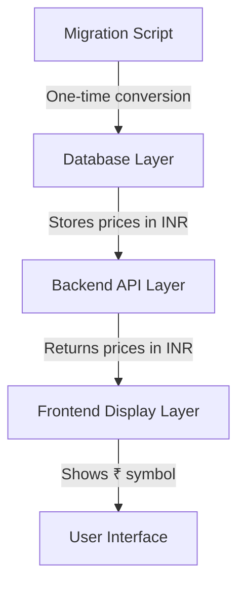

# Design Document: Currency Conversion to Rupees

## Overview

This design document specifies the technical approach for converting all currency values in the booking application from US Dollars (USD) to Indian Rupees (INR). The conversion affects three primary areas: database storage, backend API responses, and frontend display components.

The conversion uses a fixed exchange rate of **1 USD = 83 INR**. All existing service prices stored in USD will be migrated to INR, and all user-facing displays will show the rupee symbol (₹) instead of the dollar symbol ($).

### Scope

**In Scope:**
- Database schema (Service.price field remains Float type)
- Data migration script to convert existing USD prices to INR
- Frontend display components (ServicesPage, BookingPage, MyBookingsPage)
- Currency symbol replacement ($ → ₹)
- Numeric precision handling (two decimal places)

**Out of Scope:**
- Dynamic exchange rate fetching
- Multi-currency support
- User currency preferences
- Historical price tracking
- Currency conversion APIs
- Backend price calculation logic (prices are already stored, no conversion needed at runtime)

## Architecture

### System Components

The currency conversion feature touches three architectural layers:



### Component Responsibilities

1. **Database Layer (Prisma Schema)**
   - Stores service prices as Float values in INR
   - No schema changes required (Float type supports INR values)

2. **Migration Script**
   - One-time execution to convert existing USD prices to INR
   - Multiplies each Service.price by 83
   - Rounds to two decimal places
   - Updates all Service records

3. **Backend API Layer**
   - No changes required
   - Continues to return Service.price values as-is (now in INR)
   - Maintains existing JSON response structure

4. **Frontend Display Layer**
   - Updates all price display formatting
   - Replaces `$` with `₹` symbol
   - Maintains `.toFixed(2)` precision formatting

## Components and Interfaces

### Migration Script

**File:** `backend/src/migrate-currency.ts`

**Purpose:** One-time script to convert all existing USD prices to INR.

**Interface:**
```typescript
async function migrateCurrencyToINR(): Promise<void>
```

**Algorithm:**
1. Connect to database using Prisma client
2. Fetch all Service records
3. For each service:
   - Calculate new price: `newPrice = oldPrice * 83`
   - Round to 2 decimal places: `Math.round(newPrice * 100) / 100`
   - Update service record with new price
4. Log conversion results
5. Disconnect from database

**Error Handling:**
- Wrap in try-catch block
- Log errors with service ID context
- Exit with error code on failure
- Verify all records updated successfully

### Frontend Display Components

#### ServicesPage Component

**File:** `frontend/src/pages/ServicesPage.tsx`

**Changes Required:**
- Line 52: Replace `${service.price.toFixed(2)}` with `₹{service.price.toFixed(2)}`

**Before:**
```typescript
<span className="font-medium text-slate-800">${service.price.toFixed(2)}</span>
```

**After:**
```typescript
<span className="font-medium text-slate-800">₹{service.price.toFixed(2)}</span>
```

#### BookingPage Component

**File:** `frontend/src/pages/BookingPage.tsx`

**Changes Required:**
- Line 82: Replace `${service.price.toFixed(2)}` with `₹{service.price.toFixed(2)}`

**Before:**
```typescript
<span className="font-medium text-slate-800">${service.price.toFixed(2)}</span>
```

**After:**
```typescript
<span className="font-medium text-slate-800">₹{service.price.toFixed(2)}</span>
```

#### MyBookingsPage Component

**File:** `frontend/src/pages/MyBookingsPage.tsx`

**Changes Required:**
- Line 68: Replace `${b.service.price.toFixed(2)}` with `₹{b.service.price.toFixed(2)}`

**Before:**
```typescript
{b.resource.name} · {b.service.duration} min · ${b.service.price.toFixed(2)}
```

**After:**
```typescript
{b.resource.name} · {b.service.duration} min · ₹{b.service.price.toFixed(2)}
```

## Data Models

### Service Model

**Schema:** `backend/prisma/schema.prisma`

**No changes required.** The existing Float type supports INR values with sufficient precision.

```prisma
model Service {
  id          String    @id @default(cuid())
  name        String
  description String
  duration    Int       // in minutes
  price       Float     // Now stores INR instead of USD
  bookings    Booking[]
  createdAt   DateTime  @default(now())
  updatedAt   DateTime  @updatedAt
}
```

### Price Conversion Formula

**Exchange Rate:** 1 USD = 83 INR (fixed)

**Conversion Formula:**
```
INR_Price = USD_Price × 83
Rounded_INR_Price = Math.round(INR_Price × 100) / 100
```

**Examples:**
- $50.00 → ₹4150.00
- $80.00 → ₹6640.00
- $25.50 → ₹2116.50

### Seed Data Updates

**File:** `backend/src/seed.ts`

**Changes Required:**
Update the seed data prices from USD to INR:

**Before:**
```typescript
await prisma.service.createMany({
  data: [
    {
      name: 'Haircut & Styling',
      description: 'Professional haircut with styling consultation. Includes wash and blow-dry.',
      duration: 45,
      price: 50.0,  // USD
    },
    {
      name: 'Deep Tissue Massage',
      description: 'Therapeutic massage targeting deep muscle layers to relieve chronic tension.',
      duration: 60,
      price: 80.0,  // USD
    },
  ],
});
```

**After:**
```typescript
await prisma.service.createMany({
  data: [
    {
      name: 'Haircut & Styling',
      description: 'Professional haircut with styling consultation. Includes wash and blow-dry.',
      duration: 45,
      price: 4150.0,  // INR (50 * 83)
    },
    {
      name: 'Deep Tissue Massage',
      description: 'Therapeutic massage targeting deep muscle layers to relieve chronic tension.',
      duration: 60,
      price: 6640.0,  // INR (80 * 83)
    },
  ],
});
```

## Error Handling

### Migration Script Error Handling

**Scenarios:**

1. **Database Connection Failure**
   - Error: Cannot connect to database
   - Handling: Log error, exit with code 1
   - Recovery: Check DATABASE_URL environment variable

2. **Service Record Update Failure**
   - Error: Failed to update specific service
   - Handling: Log service ID and error, continue with remaining services
   - Recovery: Manual verification and retry for failed records

3. **Precision Loss**
   - Error: Rounding causes unexpected precision
   - Handling: Use `Math.round(price * 100) / 100` to ensure 2 decimal places
   - Validation: Verify all prices have exactly 2 decimal places

### Frontend Display Error Handling

**Scenarios:**

1. **Undefined Price Value**
   - Error: `service.price` is undefined or null
   - Handling: Display "Price unavailable" or skip rendering
   - Prevention: Backend validation ensures price is always present

2. **Invalid Price Format**
   - Error: Price is not a number
   - Handling: Use `Number(price).toFixed(2)` with fallback
   - Prevention: TypeScript type checking

## Testing Strategy

### Property-Based Testing Applicability

**Assessment:** Property-based testing is **NOT applicable** for this feature.

**Reasoning:**
- This feature is primarily a **data migration** (one-time conversion) and **UI display change** (string formatting)
- No complex algorithms or business logic with varying input spaces
- The conversion is a simple multiplication operation with a fixed constant
- UI changes are string replacements with no conditional logic
- Better suited for **example-based unit tests** and **integration tests**

### Testing Approach

#### Unit Tests

**Migration Script Tests:**
1. **Test: Correct conversion calculation**
   - Input: Service with price $50.00
   - Expected: Price updated to ₹4150.00
   - Validates: Requirements 1.2, 1.3

2. **Test: Precision rounding**
   - Input: Service with price $25.55
   - Expected: Price updated to ₹2120.65 (25.55 × 83 = 2120.65)
   - Validates: Requirements 1.3, 6.2

3. **Test: Multiple services conversion**
   - Input: Multiple services with different USD prices
   - Expected: All prices converted correctly
   - Validates: Requirements 4.1, 4.2

4. **Test: Zero price handling**
   - Input: Service with price $0.00
   - Expected: Price remains ₹0.00
   - Validates: Edge case handling

**Frontend Display Tests:**
1. **Test: Rupee symbol display on ServicesPage**
   - Input: Service with price 4150.00
   - Expected: Display shows "₹4150.00"
   - Validates: Requirements 3.1, 3.2, 3.3

2. **Test: Rupee symbol display on BookingPage**
   - Input: Service with price 6640.00
   - Expected: Display shows "₹6640.00"
   - Validates: Requirements 3.1, 3.2, 3.4

3. **Test: Rupee symbol display on MyBookingsPage**
   - Input: Booking with service price 4150.00
   - Expected: Display shows "₹4150.00"
   - Validates: Requirements 3.1, 3.2, 3.5

4. **Test: No dollar symbol present**
   - Input: Any service price
   - Expected: No "$" character in rendered output
   - Validates: Requirements 5.2

5. **Test: Decimal precision formatting**
   - Input: Service with price 4150.5 (one decimal)
   - Expected: Display shows "₹4150.50" (two decimals)
   - Validates: Requirements 3.2, 6.3

#### Integration Tests

1. **Test: End-to-end currency display**
   - Setup: Seed database with INR prices
   - Action: Navigate through all pages (Services → Booking → My Bookings)
   - Expected: All prices display with ₹ symbol and correct formatting
   - Validates: Requirements 3.3, 3.4, 3.5, 5.3

2. **Test: API response format**
   - Action: Fetch services from API
   - Expected: Response contains prices in INR (numeric values)
   - Validates: Requirements 2.1, 2.3

3. **Test: Booking creation with INR prices**
   - Action: Create a new booking
   - Expected: Booking record stores correct INR price
   - Validates: Requirements 1.4, 2.2

#### Manual Testing Checklist

1. Run migration script on development database
2. Verify all service prices converted correctly in database
3. Start frontend and backend applications
4. Navigate to Services page → verify ₹ symbol and prices
5. Click "Book" on a service → verify ₹ symbol on booking page
6. Complete a booking → navigate to My Bookings → verify ₹ symbol
7. Verify no "$" symbols appear anywhere in the UI
8. Check browser console for any errors
9. Verify all prices show exactly 2 decimal places

### Test Execution Order

1. **Unit tests** (migration script and display formatting)
2. **Integration tests** (API responses and end-to-end flow)
3. **Manual testing** (visual verification and user experience)

### Testing Tools

- **Unit Testing:** Jest or Vitest (for TypeScript)
- **Integration Testing:** Supertest (for API), React Testing Library (for components)
- **Manual Testing:** Browser-based testing in development environment

## Implementation Plan

### Phase 1: Database Migration
1. Create migration script (`backend/src/migrate-currency.ts`)
2. Test migration script on development database
3. Backup production database (if applicable)
4. Run migration script on production database
5. Verify all prices converted correctly

### Phase 2: Seed Data Update
1. Update `backend/src/seed.ts` with INR prices
2. Test seed script to ensure correct prices

### Phase 3: Frontend Updates
1. Update ServicesPage component
2. Update BookingPage component
3. Update MyBookingsPage component
4. Test all pages in development environment

### Phase 4: Testing and Validation
1. Run unit tests
2. Run integration tests
3. Perform manual testing
4. Verify no regressions

### Phase 5: Deployment
1. Deploy backend changes (migration script execution)
2. Deploy frontend changes (updated components)
3. Monitor for errors
4. Verify production functionality

## Rollback Strategy

**If issues are detected after deployment:**

1. **Database Rollback:**
   - Create reverse migration script: `INR_Price / 83 = USD_Price`
   - Execute on affected records
   - Restore from backup if necessary

2. **Frontend Rollback:**
   - Revert component changes (₹ → $)
   - Redeploy previous version

3. **Verification:**
   - Check all prices display correctly
   - Verify no data corruption
   - Test booking creation flow

## Assumptions and Constraints

### Assumptions
1. Exchange rate of 1 USD = 83 INR is acceptable and will not change
2. All existing prices are in USD
3. Float type provides sufficient precision for INR values
4. No historical price tracking is required
5. All users will see prices in INR (no multi-currency support)

### Constraints
1. Migration must be executed during low-traffic period
2. Database backup must be created before migration
3. Frontend and backend deployments should be coordinated
4. No changes to API response structure (only values change)
5. Existing bookings retain their original prices (no retroactive conversion)

## Security Considerations

1. **Migration Script Access:**
   - Restrict execution to authorized administrators only
   - Require database credentials with write permissions
   - Log all migration activities

2. **Data Integrity:**
   - Verify conversion accuracy before deployment
   - Maintain audit trail of price changes
   - Test rollback procedure

3. **Input Validation:**
   - Ensure prices remain positive values
   - Validate numeric precision
   - Prevent injection attacks in migration script

## Performance Considerations

1. **Migration Script:**
   - Batch updates if service count is large (>1000 records)
   - Use database transactions for atomicity
   - Estimated execution time: <1 second for typical dataset

2. **Frontend Rendering:**
   - No performance impact (string formatting is negligible)
   - No additional API calls required

3. **Database Queries:**
   - No changes to query performance
   - Float type operations remain unchanged

## Monitoring and Observability

1. **Migration Monitoring:**
   - Log number of services updated
   - Log any conversion errors
   - Verify final count matches initial count

2. **Application Monitoring:**
   - Monitor for frontend errors related to price display
   - Track API response times (should remain unchanged)
   - Monitor user feedback for currency confusion

3. **Success Metrics:**
   - 100% of services display ₹ symbol
   - 0% of pages show $ symbol
   - No increase in error rates
   - No user complaints about pricing display

